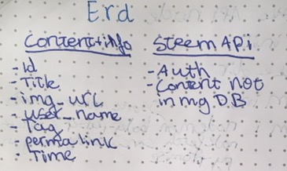

# Project Overview

##Link To SteemPX
[steempx](https://steempx.herokuapp.com/)

## Project Schedule
### Personal Final Project

|  Day | Deliverable |
|---|---|
|Day 1: Thu 5/24 | Wireframes, Priority Matrix, Schedule, Time Estimates, build react app with components |
|Day 2: Fri 5/25 | Approval\Pseudocode\Actual code\|
|Day 3: Sat 5/26 | research steem api  |
|Day 4: Sun 5/27 | research steem blockchain |
|Day 5: Mon 5/28 | React components  |
|Day 6: Tues 5/29 | React components  |
|Day 7: Wed 5/30 | Node API / deploy API and React  |
|Day 8: Thurs 5/31  | React components  |
|Day 9: Fri 6/1 | Working Prototype with full commit to master |
|Day 10: Sat 6/2 | Styling |
|Day 11: Sun 6/3 | styling |
|Day 12: Mon 6/4 | Project Presentations |

## Project Description

My final project will be a mx of [Steemit](steemit.com) and [500px](https://500px.com/)/[Pinterest](https://pinterest.com/).
In this case I will cut out the middle man 500px/Pinterest and reward the content creator directly with Steem tokens which are ease to exchange for bitcoin, dollars or other coins.

## Title: Steempx

## Project Overview
This is a platform where photographers can look for inspiration and share there pictures. Because of steems "proof-of-brain" protocol the creator gets rewards via likes and/or donations.

## Wireframes


## ERD



## Technologies

- React js
- Steem
- Node js


## Priority Matrix

| part | Priority | Estimated Time | Time Invetsted | Actual Time |
| --- | :---: |  :---: | :---: | :---: |
| readme | H | 30mins| 10mins | 10mins |
| post/delete on the Steem blockchain | H | 10hrs| 5hrs | 5hrs |
| login with Steem | H | 2hrs| 1hr | 1hr |
| api with node.js | H | 15hrs| 4hrs | 4hrs |
| React native app | h | 40hrs| 40hrs | 40hrs |
| Styling          | l | 20hrs | 20hrs |20hrs |

## MVP

- Post/Delete (own Database and Steem)
- Auth user
- Select one image
- Show user info
- Deploy

## POST MVP

- Show other users info
- Give Steem by liking
- Comments on post
- Deploy on decentralized Database


## Helper Functions
- Make permalink function

| Function | Description |
| --- | :---: |  
| Permalink | this will replace a white space in a string with a dash  |

## Additional Libraries
- steemjs
- jQuery
- Google Font
- bootstrap

## Code Snippet

Here I change the content on the new post page based on state changes.
```
<button type='submit'>Post</button>
</form></div></div>);
const loading = (<div className='loader'></div>);
const failed = (<div className="error-post-msg"><p>Username And Password Don't match</p></div>);
const confirmation = (<div className="confirmation-box"><h1>Sent!</h1><hr />
<h3>Block nr: {this.state.block.block}</h3>
<h3>transaction nr: {this.state.block.trx}</h3>
</div>)


return (
<div className='col-8'>
  {this.state.failed && failed}
  {this.state.form && form}
  {this.state.sendLoading && loading}
  {this.state.confirmation && confirmation}

</div>
)
}
}

export default New;
```  
